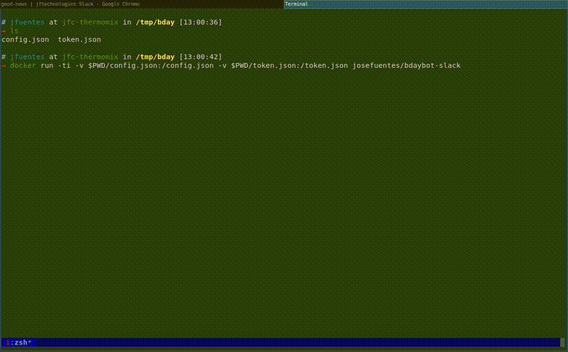

# bdaybot-slack

This is a program that reads a list of people with their birthdays (from a Google Spreadsheet, and says happy bday in Slack.

This is intended to be run by some external mechanism once a day. I run it in a [cronjob in Kubernetes](https://kubernetes.io/docs/concepts/workloads/controllers/cron-jobs/) (I will update this repo to add the k8s manifest).

<a href="https://drive.google.com/file/d/1C6o5qxoTbUxGmmxbXkJMcEWHrllnBxxo/view?usp=sharing" target="blank"></a>

## Inputs

This uses two input files:

**config.json**

Holds all the configurable options for the app. You can just copy and edit the example in this repo ([config.json.example](./config.json.example)).

Here you have a brief description of the fields in the file:

- `calendar.google_sheet.url`: url to the Google spreadsheet with the list of bdays. You can [make a copy from this example](https://docs.google.com/spreadsheets/d/1f1GJ7MnUgQOC-RsbB4Vi_m3YnjQqTNbE5_-hyIbfuUk/edit?usp=sharing).

- `oauth2.client_id` and `oauth2.client_secret`: these are the credentials of the client part of the oauth client, used for the authentication against Google. You can find more info about how to get this setup [here](./docs/client_oauth.md).

- `slack.webhook_url`: Slack webhook url where to send the happy bday messages. 

- `slack.admin_webhook_url`: Slack webhook url where to send errors, or other events.

- `slack.salute_prefix` and `slack.salute_suffix`: These are used to compose the happy birthday message, which would be something like `<prefix>@alice and @bob<suffix>`. You can use emojis!

**token.json**

Holds the information that the app uses to authenticate against Google in order to get access to the spreadsheet.

You can get this by using the `-auth` argument.

## Standalone run

### Using the binary

You can execute the auth flow by running `bdayboy -auth`.

The normal operation is executed when you call the binary without arguments: `bdaybot`.

There is a help command that shows the different configurable options: `bdaybot -help`.

In order to log some interesting messages on screen run `bdaybot -logtostderr`.

It will try to read `config.json` and `token.json` from the working directory.

### Using docker

You can use the same functionality with the docker image. Notice you will need to mount `config.json` and `token.json`:

```
touch token.json
docker run -ti -v $PWD/token.json:/token.json josefuentes/bdaybot-slack -auth
```

The docker image logs event to stderr by default.

```
docker run -ti -v $PWD/config.json:/config.json -v $PWD/token.json:/token.json josefuentes/bdaybot-slack
```

## Build from scratch

### Using Docker

You can build a minimal docker image by running:

```
docker build -t <name of your image> .
```

### Just Go

Just run `go build -o bdaybot` and a binary called `bdaybot` will be generated.

