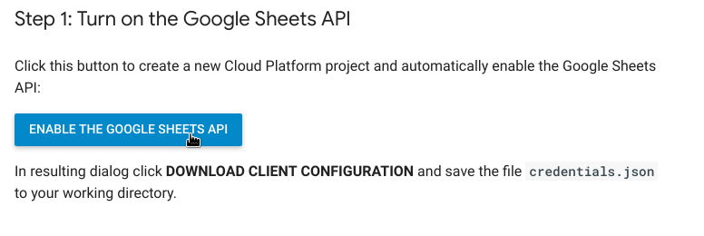

## How to get `client_id` and `client_secret`

This app uses oauth2 to authenticate against Google Docs.

This protocol requires the client app to be registered in the server. Usually apps creator do that when they distribute their apps.

In order to get a pair of `client_id` and `client_secret` keys:

- Go to [Google Sheets API developers console](https://developers.google.com/sheets/api/quickstart/go)
- Login with the account you want to use to register the app.
- Click on "ENABLE THE GOOGLE SHEETS API":

- You will be presented with a pop-up that contains, among other things, a text box with "Client ID" and a "Client Secret". Copy those values and paste them in your `config.json` file.
